```{r echo=FALSE, message=FALSE, warning=FALSE}
if (!requireNamespace("BiocManager", quietly = TRUE))
    install.packages("BiocManager")
if (!requireNamespace("GEOmetadb", quietly = TRUE))
    BiocManager::install("GEOmetadb")

library(GEOmetadb)
library(knitr)
library(edgeR)
library(limma)
# for heatmap
library(ComplexHeatmap)
library(circlize)
# color scalers
library(scales)
# %>%
library(magrittr) 
library(dplyr)

```

**Note**: Some codes adapted from the lecture silds written by Ruth Isserlin. To compile this markdown file, please include the **data** and **figures** folder and place them at the same directory with this file.

# Introduction
For this assignment, I used **Transcriptional profile of human STAT1-/- fibroblasts expressing LY6E or empty control vector** data [GSE111958](https://www.ncbi.nlm.nih.gov/geo/query/acc.cgi?acc=GSE111958), 11433 genes 6 samples, which about if LY6E will enhance the infectivity of some viruses[@LY6E_2018]. In assignment 1, I had already cleaned and normalized the data, in this assignment, I will do Differential Gene Expression analysis and Thresholded over-representation analysis. \
Boxplot and density plot from A1  \
\
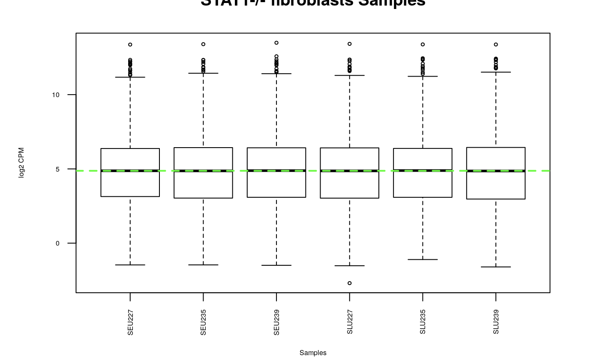
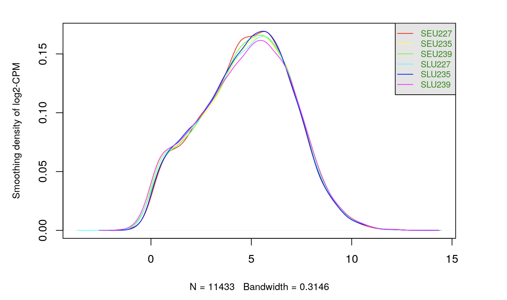

# Perparation
## Launching RStudio in Docker
First of all, use the following command to launch Rstudio in Docker.
```
docker run -e PASSWORD=1234 --rm -p 8787:8787 -v /Users/bfx/Documents/BCB420:/home/rstudio/docker_bcb420 risserlin/bcb420-base-image
```
## Load the data
Use the normalized data from assignment 1. 
```{r}
normalized_count_data <- read.table(file=file.path("data", "GSE111958_finalized_normalized _counts.txt"),
                                    header = TRUE,sep = "\t",
                                    stringsAsFactors = FALSE,
                                    check.names=FALSE)
kable(normalized_count_data[1:5, ], type="html")

```


The number of genes
```{r}
nrow(normalized_count_data)
```


# Heatmap
```{r}
# Create the numerical matrix for heatmap
heatmap_matrix <- normalized_count_data[ , 2:ncol(normalized_count_data)]
rownames(heatmap_matrix) <- normalized_count_data$GENE_NAME
colnames(heatmap_matrix) <- colnames(normalized_count_data[, 2:ncol(normalized_count_data)])
```

```{r}
# Create the heatmap
if(min(heatmap_matrix) == 0){
    heatmap_col = colorRamp2(c( 0, max(heatmap_matrix)), c( "white", "red"))
  } else {
    heatmap_col = colorRamp2(c(min(heatmap_matrix), 0, max(heatmap_matrix)), c("blue", "white", "red"))
  }
current_heatmap <- Heatmap(as.matrix(heatmap_matrix),
                               show_row_dend = TRUE,
                               show_column_dend = TRUE, 
                               col=heatmap_col,
                               show_column_names = TRUE, 
                               show_row_names = FALSE,
                               show_heatmap_legend = TRUE
                               )
without_row_normalization_heatmap<- current_heatmap
```
Draw the heatmap directly, we can see that the range of the data is too large and the most value are distributed at low counts, so the whole heatmap is blue and only the top is red. 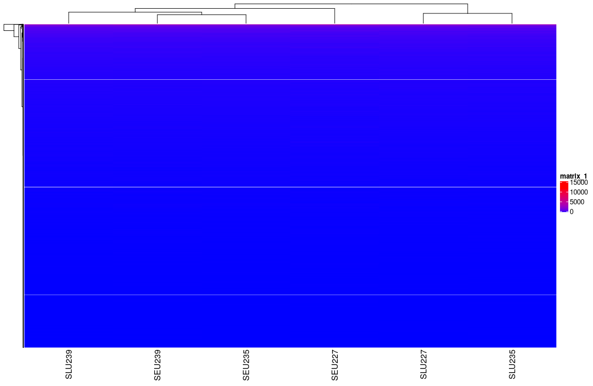 

## Row-normalization heatmap
```{r}
# Row-normalization
heatmap_matrix <- t(scale(t(heatmap_matrix)))
if(min(heatmap_matrix) == 0){
    heatmap_col = colorRamp2(c( 0, max(heatmap_matrix)), c( "white", "red"))
  } else {
    heatmap_col = colorRamp2(c(min(heatmap_matrix), 0, max(heatmap_matrix)), c("blue", "white", "red"))
  }
current_heatmap <- Heatmap(as.matrix(heatmap_matrix),
                               show_row_dend = TRUE,
                               show_column_dend = TRUE, 
                               col=heatmap_col,
                               show_column_names = TRUE, 
                               show_row_names = FALSE,
                               show_heatmap_legend = TRUE
                               )
row_normalization_heatmap <- current_heatmap

```
Scale each row and centre the around the mean, so we can narrow down the range of the data to make the heatmap more easy to read. 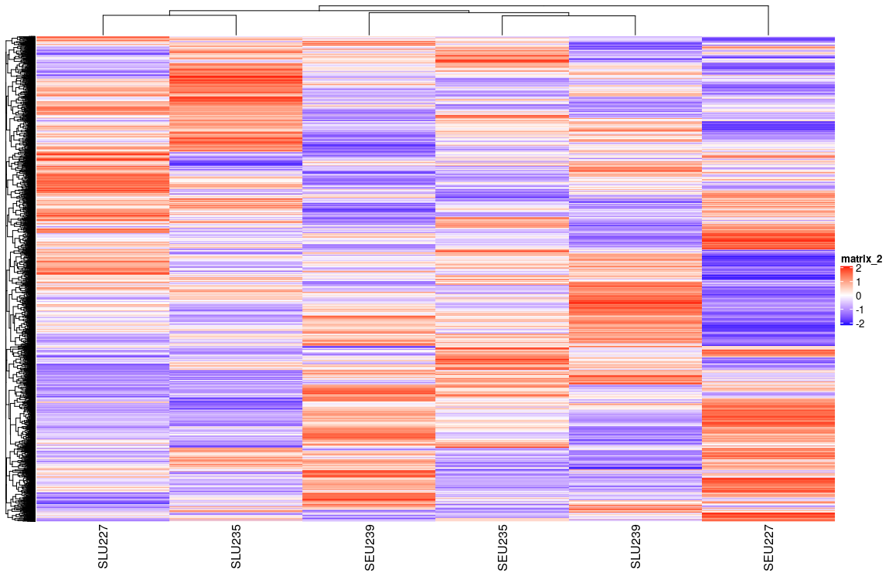


# Differential Gene Expression

## Define Groups
```{r}
empty_samples <- grep(colnames(normalized_count_data),
                          pattern="^SEU")
LY6E_samples <- grep(colnames(normalized_count_data),
                          pattern="^SLU")
gene_of_interest <- which(normalized_count_data$GENE_NAME == "LY6E")


# LY6E expression in empty samples
LY6E_empty_samples <- t(normalized_count_data
                       [gene_of_interest,
                         empty_samples])
colnames(LY6E_empty_samples) <- c("empty_samples")
LY6E_empty_samples

# LY6E expression in LY6E samples
LY6E_L_samples <- t(normalized_count_data
                       [gene_of_interest,
                         LY6E_samples])
colnames(LY6E_L_samples) <- c("LY6E_samples")
LY6E_L_samples

# Using a simple t.test compare STAT1 gene. 
# The null hypothesis of the two sample t-test is that there is no difference in means of each sample 
# It assumes that both stat1_LY6E_samples and stat1_empty_samples are normally distributed.
t.test(x=t(LY6E_L_samples),y=t(LY6E_empty_samples))
```
There is significant difference between two groups.

### MDSPlot
Now we can revisit the MDSPlot with limma package 
```{r}
rep_colors <- rainbow(3)
rep_colors<- rep(rep_colors, 2)

limma::plotMDS(heatmap_matrix, col=rep_colors)
```
\ The first 3 character represent the conditions (Empty control or	LY6E), nicely separated

```{r}
samples <- data.frame(lapply(colnames(normalized_count_data)[2:7], 
        FUN=function(x){unlist(strsplit(x, perl=TRUE, "(?=[A-Za-z])(?<=[0-9])|(?=[0-9])(?<=[A-Za-z])"))}))

colnames(samples) <- colnames(normalized_count_data)[2:7]
rownames(samples) <- c("cell_type", "rep")
samples <- data.frame(t(samples))
samples

```

## Limma

### Simple
```{r}
model_design <- model.matrix(~ samples$cell_type)
kable(model_design, type="html")
```


```{r}
# Create data matrix
expressionMatrix <- as.matrix(normalized_count_data[,2:7])
rownames(expressionMatrix) <- normalized_count_data$GENE_NAME
colnames(expressionMatrix) <- colnames(normalized_count_data)[2:7]
minimalSet <- ExpressionSet(assayData=expressionMatrix)

# Fit the data to the model
fit <- lmFit(minimalSet, model_design)

# Apply empircal Bayes to compute differential expression for the above described model.
fit2 <- eBayes(fit,trend=TRUE)
topfit <- topTable(fit2, 
                   coef=ncol(model_design),
                   adjust.method = "BH",
                   number = nrow(expressionMatrix))

# Merge hgnc names to topfit table
output_hits <- merge(normalized_count_data[,1],
                     topfit,
                     by.y=0,by.x=1,
                     all.y=TRUE)
# Rename the colnames
colnames(output_hits)<-c("hgnc_symbol", colnames(output_hits)[2:ncol(output_hits)])

# sort by pvalue
output_hits <- output_hits[order(output_hits$P.Value),]

kable(output_hits[1:10,],type="html")
```

\ the number of genes pass the threshold p-value < 0.05
```{r}
length(which(output_hits$P.Value < 0.05))
```

\ the number of genes pass correction
```{r}
length(which(output_hits$adj.P.Val < 0.05))
```

### Account for the rep variability
Account for the rep variability to improve the results
```{r}
model_design_rep <- model.matrix(
  ~ samples$rep + samples$cell_type)
kable(model_design_rep,type="html")
```

Fit the data to the new model
```{r}
fit_rep <- lmFit(minimalSet, model_design_rep)
```

Apply empircal Bayes to compute differential expression for the new model
```{r}
# Since my data is RNA-seq data, we set the parameter trend=TRUE
fit2_rep <- eBayes(fit_rep,trend=TRUE)

topfit_rep <- topTable(fit2_rep, 
                   coef=ncol(model_design_rep),
                   adjust.method = "BH",
                   number = nrow(expressionMatrix))
# Merge hgnc names to topfit table
output_hits_rep <- merge(normalized_count_data[,1],
                         topfit_rep,
                         by.y=0,by.x=1,
                         all.y=TRUE)
# Rename the colnames
colnames(output_hits_rep)<-c("hgnc_symbol", colnames(output_hits_rep)[2:ncol(output_hits)])

# Sort by pvalue
output_hits_rep <- output_hits_rep[order(output_hits_rep$P.Value),]

kable(output_hits_rep[1:10,],type="html")

```

\ the number of genes pass the threshold p-value < 0.05
```{r}
length(which(output_hits_rep$P.Value < 0.05))
```

\ the number of genes pass correction
```{r}
length(which(output_hits_rep$adj.P.Val < 0.05))
```


### MA plot
Draw MA plot, The point looks too few, but I checked dim(topfit) which is ```r dim(topfit)```. Seems like the range of the data is too large.
```{r}
differential_expression_results <- topfit[rownames(minimalSet), ]
differential_expression_status <- apply(differential_expression_results, 1, function(gene){
  if (gene["P.Value"] < 0.05) {
    if (gene["logFC"] < 0 ){
       return("Downregulated genes")
    }
    else{
      return("Upregulated genes")
    }
  } else {
    return("Not differentially expressed")
  }
})

limma::plotMD(fit2, column = ncol(fit2), cex = 0.5, status = differential_expression_status,
              main = "Differential gene expression")

```


### Compare two models
Compare the results from two different models
```{r}
simple_model_pvalues <- data.frame(hgnc_symbol = output_hits$hgnc_symbol,
                                   simple_pvalue=output_hits$P.Value)
rep_model_pvalues <-  data.frame(hgnc_symbol = output_hits_rep$hgnc_symbol,
                                 rep_pvalue = output_hits_rep$P.Value)
two_models_pvalues <- merge(simple_model_pvalues,
                            rep_model_pvalues,by.x=1,by.y=1)
two_models_pvalues$colour <- "black"
two_models_pvalues$colour[two_models_pvalues$simple_pvalue<0.05] <- "orange"
two_models_pvalues$colour[two_models_pvalues$rep_pvalue<0.05] <- "blue"
two_models_pvalues$colour[two_models_pvalues$simple_pvalue<0.05 & two_models_pvalues$rep_pvalue<0.05] <- "red"

# plot
plot(two_models_pvalues$simple_pvalue,two_models_pvalues$rep_pvalue,
     col = two_models_pvalues$colour,
     xlab = "simple model p-values",
     ylab ="Rep model p-values", 
     main="Simple vs Rep Limma")
```

For the interest gene
```{r}
hgnc_symbol_of_interest <- "LY6E"

# There are too many overlap around the gene of interest, so I set others genes be transparent
two_models_pvalues$colour <- alpha("grey", 0.2)
two_models_pvalues$colour[two_models_pvalues$hgnc_symbol==hgnc_symbol_of_interest] <- "red"

plot(two_models_pvalues$simple_pvalue,two_models_pvalues$rep_pvalue,
     col = two_models_pvalues$colour,
     xlab = "Simple model p-values",
     ylab ="Rep model p-values",
      main="Simple vs Rep Limma (for interest gene)")

# Since there are too many overlap arround the gene of interest, use a point to mark the location of it.
points(two_models_pvalues[two_models_pvalues$hgnc_symbol==hgnc_symbol_of_interest, 2:3], pch=24,  col="red", cex=1.5)

```

### Heatmap with the top hits
Draw the Heatmap with the top hits using Limma (accounting for rep variability) which only show the p-value < 0.05 and columns ordered by cell type.
```{r}
top_hits <- output_hits_rep$hgnc_symbol[output_hits_rep$P.Value<0.01]
heatmap_matrix_tophits <- t(
  scale(t(heatmap_matrix[which(rownames(heatmap_matrix) %in% top_hits),]))) 
heatmap_matrix_tophits<- heatmap_matrix_tophits[,
       c(grep(colnames(heatmap_matrix_tophits), pattern = "^SEU"), 
         grep(colnames(heatmap_matrix_tophits), pattern = "^SLU"))]
if(min(heatmap_matrix_tophits) == 0){
    heatmap_col = colorRamp2(c( 0, max(heatmap_matrix_tophits)), 
                             c( "white", "red"))
  } else {
    heatmap_col = colorRamp2(c(min(heatmap_matrix_tophits), 0, max(heatmap_matrix_tophits)), c("blue", "white", "red"))
  }
current_heatmap <- Heatmap(as.matrix(heatmap_matrix_tophits),
                  cluster_rows = TRUE,  show_row_dend = TRUE,
                  cluster_columns = FALSE,show_column_dend = FALSE,
                  col=heatmap_col,show_column_names = TRUE, 
                  show_row_names = FALSE,show_heatmap_legend = TRUE)
current_heatmap

```

\ Obviously, the heatmap show that the gene expression has significant different for different cell type.

## edgeR
```{r}
filtered_data_matrix <- as.matrix(normalized_count_data[,2:7])
rownames(filtered_data_matrix) <- normalized_count_data$GENE_NAME

# Set up edgeR objects
d = DGEList(counts=filtered_data_matrix, group=samples$cell_type)

# Estimate Dispersion
d <- estimateDisp(d, model_design_rep)

# Fit the model
fit <- glmQLFit(d, model_design_rep)

# Calculate differential expression using the Quasi liklihood model
qlf.pos_vs_neg <- glmQLFTest(fit, coef='samples$cell_typeSLU')
```

```{r}
kable(topTags(qlf.pos_vs_neg), type="html")
```

```{r}
# get all results
qlf_output_hits <- topTags(qlf.pos_vs_neg,sort.by = "PValue",
                           n = nrow(normalized_count_data))
```

\ the number of genes pass the threshold p-value < 0.05
```{r}
length(which(qlf_output_hits$table$PValue < 0.05))
```

\ the number of genes pass correction
```{r}
length(which(qlf_output_hits$table$FDR  < 0.05))
```

### Compare the results from two different  models
```{r}

qlf_rep_model_pvalues <- data.frame(
          hgnc_symbol = rownames(qlf_output_hits$table),
          qlf_rep_pvalue=qlf_output_hits$table$PValue)
limma_rep_model_pvalues <-  data.frame(
          hgnc_symbol = output_hits_rep$hgnc_symbol,
          limma_rep_pvalue = output_hits_rep$P.Value)
two_models_pvalues <- merge(qlf_rep_model_pvalues,
                            limma_rep_model_pvalues,
                            by.x=1,by.y=1)
two_models_pvalues$colour <- "black"
two_models_pvalues$colour[two_models_pvalues$qlf_rep_pvalue<0.05] <- "orange"
two_models_pvalues$colour[two_models_pvalues$limma_rep_pvalue<0.05] <- "blue"
two_models_pvalues$colour[two_models_pvalues$qlf_rep_pvalue<0.05 & two_models_pvalues$limma_rep_pvalue<0.05] <- "red"

```

```{r}
# plot
plot(two_models_pvalues$qlf_rep_pvalue,
     two_models_pvalues$limma_rep_pvalue,
     col = two_models_pvalues$colour,
     xlab = "QLF rep model p-values",
     ylab ="Limma rep model p-values",
     main="QLF vs Limma ")
```

```{r}
hgnc_symbol_of_interest <- "LY6E"

two_models_pvalues$colour <- "grey"
two_models_pvalues$colour[two_models_pvalues$hgnc_symbol==hgnc_symbol_of_interest] <- "red"
plot(two_models_pvalues$qlf_rep_pvalue,
     two_models_pvalues$limma_rep_pvalue,
     col = two_models_pvalues$colour,
     xlab = "QLF patient model p-values",
     ylab ="Limma Patient model p-values",
     main="QLF vs Limma (for interest gene)")

# Since there are too many overlaps arround the gene of interest, use a point to mark the location of it.
points(two_models_pvalues[
  two_models_pvalues$hgnc_symbol==hgnc_symbol_of_interest,2:3],
       pch=24,  col="red", cex=1.5)
```

Draw the Heatmap with top hit using QLF model
```{r}
top_hits <- rownames(qlf_output_hits$table)[output_hits_rep$P.Value<0.05] 
heatmap_matrix_tophits <- t(
  scale(t(heatmap_matrix[which(rownames(heatmap_matrix) %in% top_hits),]))) 
heatmap_matrix_tophits<- heatmap_matrix_tophits[,
       c(grep(colnames(heatmap_matrix_tophits),pattern = "^SEU"), 
         grep(colnames(heatmap_matrix_tophits),pattern = "^SLU"))]
if(min(heatmap_matrix_tophits) == 0){
    heatmap_col = colorRamp2(c( 0, max(heatmap_matrix_tophits)), 
                             c( "white", "red"))
  } else {
    heatmap_col = colorRamp2(c(min(heatmap_matrix_tophits), 0, max(heatmap_matrix_tophits)), c("blue", "white", "red"))
  }
current_heatmap <- Heatmap(as.matrix(heatmap_matrix_tophits),
                           cluster_rows = TRUE,
                           cluster_columns = FALSE,
                               show_row_dend = TRUE,
                               show_column_dend = FALSE,
                               col=heatmap_col,
                               show_column_names = TRUE, 
                               show_row_names = FALSE,
                               show_heatmap_legend = TRUE,
                               )

current_heatmap
```

\ Also obviously, the heatmap show that the gene expression has significant different for different cell type.


```{r}
# Merge gene names with the top hits
qlf_output_hits_withgn <- merge(normalized_count_data[,1],
                                qlf_output_hits, 
                                by.x=1, by.y = 0)
colnames(qlf_output_hits_withgn)<-c("hgnc_symbol", colnames(qlf_output_hits_withgn)[2:ncol(qlf_output_hits_withgn)])

qlf_output_hits_withgn[,"rank"] <- -log(qlf_output_hits_withgn$PValue,base =10) * sign(qlf_output_hits_withgn$logFC)
qlf_output_hits_withgn <- qlf_output_hits_withgn[order(qlf_output_hits_withgn$rank),]

upregulated_genes <- qlf_output_hits_withgn$hgnc_symbol[
  which(qlf_output_hits_withgn$PValue < 0.05 
             & qlf_output_hits_withgn$logFC > 0)]

downregulated_genes <- qlf_output_hits_withgn$hgnc_symbol[
  which(qlf_output_hits_withgn$PValue < 0.05 
             & qlf_output_hits_withgn$logFC < 0)]

all_differentially_expressed_genes <- qlf_output_hits_withgn$hgnc_symbol[
  which(qlf_output_hits_withgn$PValue < 0.05)]
```
We can see there are ```r length(all_differentially_expressed_genes)``` differentially expressed genes, the most differential expression are downregulated which is ```r length(downregulated_genes)```, and upregulated genes are only ```r length(upregulated_genes)```.


# Thresholded over-representation analysis
Use [g:profiler](https://biit.cs.ut.ee/gprofiler/gost) for thresholded gene set enrichment analysis. Set **organism** to "Homo sapiens", **significance threshold** to "Benjamini-Hochberg FDR" and **threshold** to "0.05". \
\
**Data sources**: \
**GO biological process**: releases/2019-07-01 \

**Reactome annotations**: ensembl classes: 2019-10-2 \

**WikiPathways**: 20190910 \

Exprot the genelist for upregulated, downregulated and all differentially expressed genes. Then use these genelist as query separately.
```{r}

# Export the genelist to txt file for g:profiler
write.table(x=upregulated_genes,
            file=file.path("data","LY6E_upregulated_genes.txt"),sep = "\t",
            row.names = FALSE,col.names = FALSE,quote = FALSE)
write.table(x=downregulated_genes,
            file=file.path("data","LY6E_downregulated_genes.txt"),sep = "\t",
            row.names = FALSE,col.names = FALSE,quote = FALSE)
write.table(x=all_differentially_expressed_genes,
            file = file.path("data", "all_differentially_expressed_genes.txt"),sep = "\t",
            row.names = FALSE,col.names = FALSE,quote = FALSE)
```


## All differentially expressed genes
The results of  differentially expressed genes 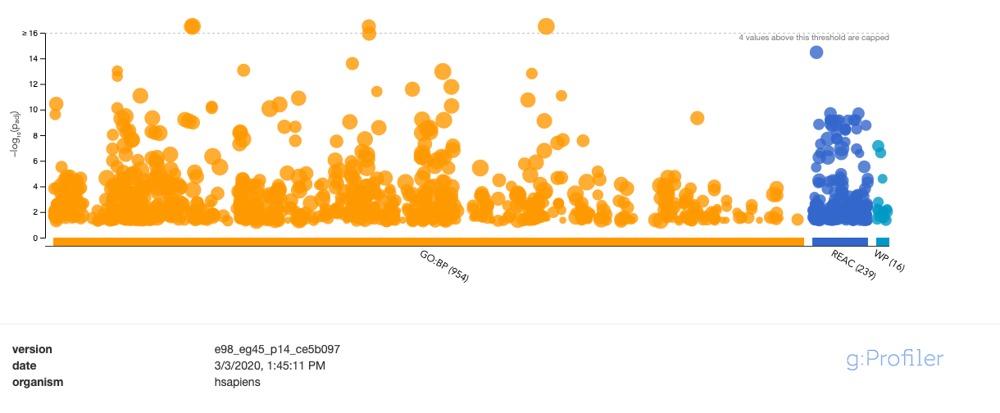\
The number of genesets for each data source:\
GO:BP: 954 \
REAC: 239 \
WP: 16 \
More details for each data source: \

### GO:BP
the top hit is cellular component organization, the number of genes found in cellular component organization is 276 \
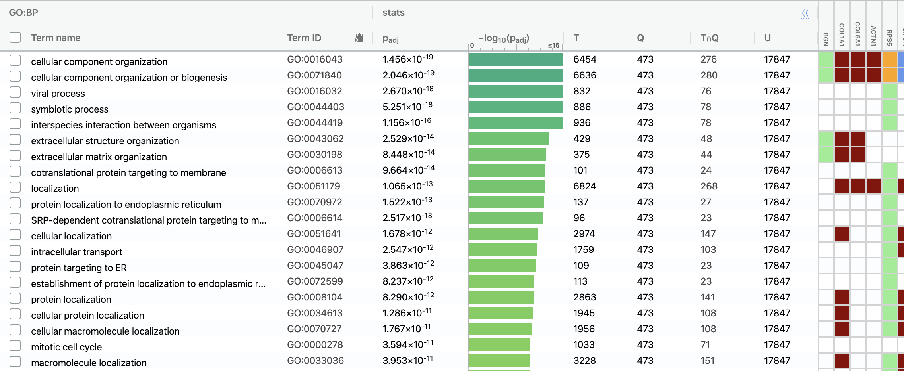

### REAC
the top hit is Axon guidance, the number of gene from query found in Axon guidance is 64 \
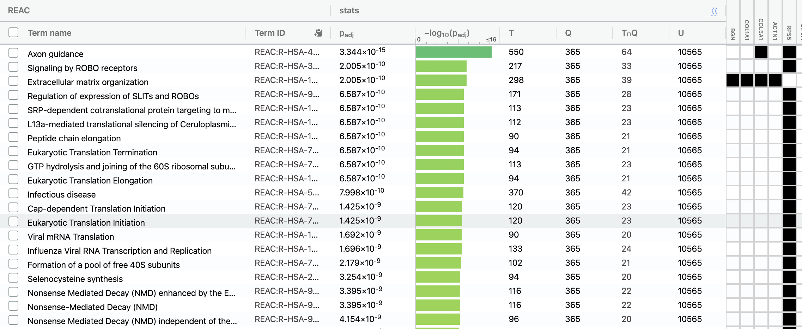

### WP 
the top hit is Focal Adhesion, the number of gene from query found in Focal Adhesion is 32 \
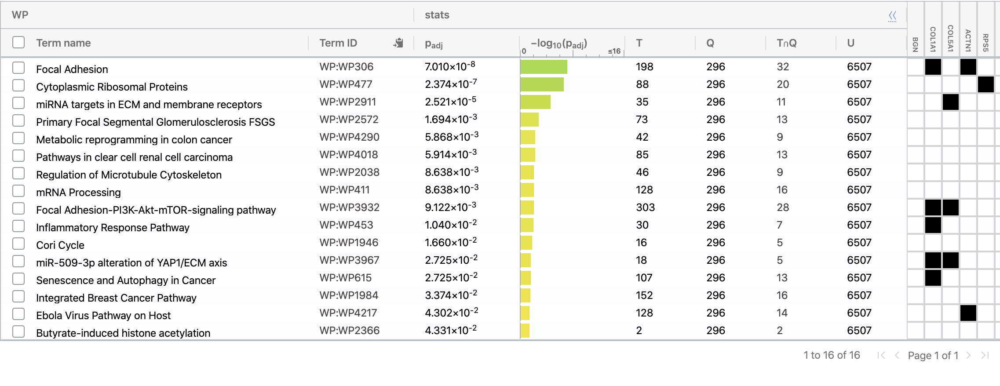

## Upregulated genes
The results of upregulated genes 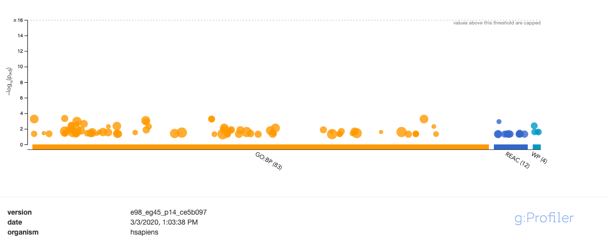 \

The number of genesets for each data source:\
GO:BP: 83 \
REAC: 12 \
WP: 4 \
More details for each data source: \
GO:BP \
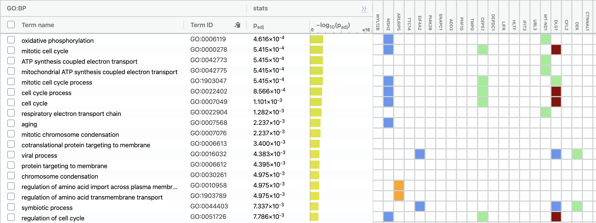

REAC \
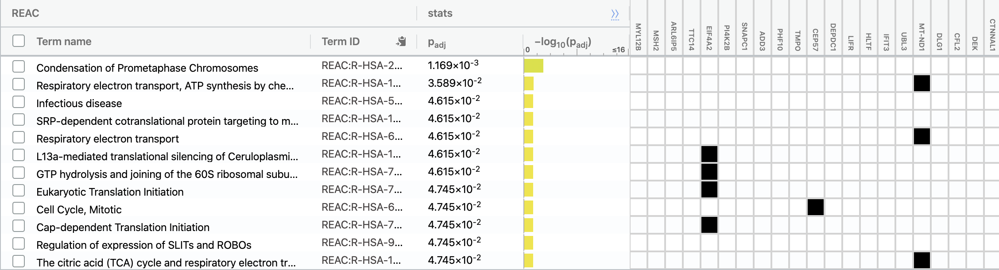 \


WP \
 \


## Downregulated genes
The results of downregulated genes 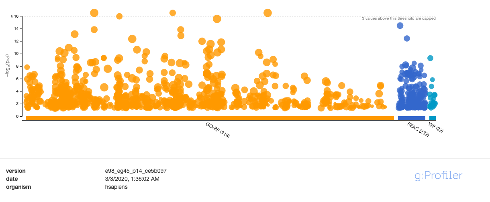 \

The number of genesets for each data source:\
GO:BP: 918 \
REAC: 232 \
WP: 22 \
More details for each data source: \
GO:BP \

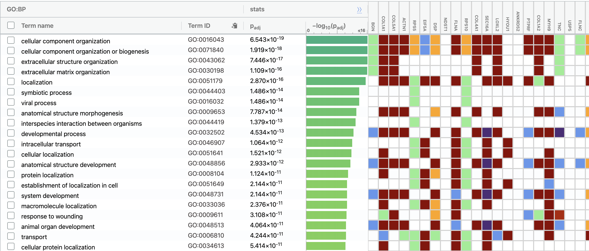

REAC \
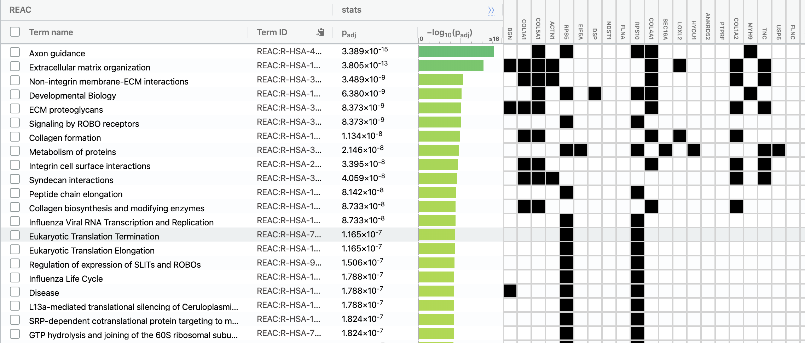 \


WP \
 \

# Interpretation
For the g:profiler results, the result of downregulated is very similar with the result of all differentially expressed genes. For the whole list, cellular component organization is the top hit and viral process is the third hit in GO:BP which are both related to the infectivity of viruses. The result of upregulated shows that some genes related to cell cycle, Mitochondria and ATP synthesis are upregulated. \
This support the conclusions discussed in the original paper that LY6E promotes early step of the virus life cycle and enhances infectivity of some viruses. \
Also I found an article "RLR-mediated antiviral innate immunity requires oxidative phosphorylation activity", published at 2017, said mitochondria is a platform for antiviral innate immunity and antiviral innate immunity requires oxidative phosphorylation (OXPHOS) activity.[@RLR2017] oxidative phosphorylation (OXPHOS) is the top hit for upregulated genelist in GO:BP and lots of genes related to mitochondria differentially expressed. \
Therefore LY6E must play some important role in early step of the virus life cycle and infectivity of some viruses.


# Reference


