```{r echo=FALSE, message=FALSE, warning=FALSE}
if (!requireNamespace("BiocManager", quietly = TRUE))
    install.packages("BiocManager")
if (!requireNamespace("GEOmetadb", quietly = TRUE))
    BiocManager::install("GEOmetadb")

library(GEOmetadb)
library(knitr)
library(edgeR)
library(limma)
# for heatmap
library(ComplexHeatmap)
library(circlize)
# color scalers
library(scales)
# %>%
library(magrittr) 
library(dplyr)

```

# Introduction
For this assignment, I used **Transcriptional profile of human STAT1-/- fibroblasts expressing LY6E or empty control vector** data, [GSE111958](https://www.ncbi.nlm.nih.gov/geo/query/acc.cgi?acc=GSE111958), 11433 genes 6 samples, which about if LY6E will enhance the infectivity of some viruses[@LY6E_2018]. In assignment 1, I had already cleaned (remove the low counts) and normalized the data. [The link for Assignment 1](https://htmlpreview.github.io/?https://github.com/bcb420-2020/student_LoadingBFX/blob/master/Assigment1.html)
```{r message=FALSE}
gse <- getGEO("GSE111958",GSEMatrix=FALSE)
kable(data.frame(head(Meta(gse))), format = "html")
```

```{r message=FALSE, warning=FALSE}
current_gpl <- names(GPLList(gse))[1]
current_gpl_info <- Meta(getGEO(current_gpl))
```

**Platform title** : `r current_gpl_info$title `<br />
**Submission data** : `r current_gpl_info$submission_date`<br />
**Last update data** : `r current_gpl_info$last_update_date`<br />
**Organims** : `r current_gpl_info$organism`<br />
**Number of GEO datasets that use this techology** : `r length(current_gpl_info$series_id)`<br />
**Number of GEO samples that use this technology** : `r length(current_gpl_info$sample_id)`<br />
<br/>

In assignment 2, I have done differential gene expression analysis and thresholded over-representation analysis. The g:profiler result shows LY6E must play some important role in early step of the virus life cycle and infectivity of some viruses, which is consistent to the results in the paper “LY6E Mediates an Evolutionarily Conserved Enhancement of Virus Infection by Targeting a Late Entry Step.”[@LY6E_2018]. [The link for Assignment 1](https://htmlpreview.github.io/?https://github.com/bcb420-2020/student_LoadingBFX/blob/master/A2_FanxingBu.html)\

In this assignment, I will take the ranked data that was created in Assignment 2 and perform non-thresholded pathway analysis, then summarize and visualize the results using Cytoscape and the Enrichment map pipeline. 

# Preparation
## Launching RStudio in Docker
First of all, use the following command to launch Rstudio in Docker.
```
docker run -e PASSWORD=1234 --rm -p 8787:8787 -v /Users/bfx/Documents/BCB420:/home/rstudio/docker_bcb420 risserlin/bcb420-base-image
```

## Get the ranked data
In Assignment 2, I have a data frame called __qlf_output_hits_withgn__ which contains the ranked data. Create a new data frame, which only contain the genename and rank, and export to __ranked_genelist.rnk__
```{r eval= FALSE}

differentially_expressed_genes <- qlf_output_hits_withgn[which(qlf_output_hits_withgn$PValue < 0.05),]
ranked_genelist <- data.frame(differentially_expressed_genes$hgnc_symbol, differentially_expressed_genes$rank)
colnames(ranked_genelist) <- c("GeneName", "rank")
ranked_genelist <- ranked_genelist[nrow(ranked_genelist):1,]

write.table(x=ranked_genelist,
            file = file.path("data", "ranked_genelist.rnk"),sep = "\t",
            row.names = FALSE,col.names = TRUE, quote = FALSE)
```

# Non-thresholded Gene set Enrichment Analysis
## Perform non-thresholded gene set enrichment analysis with GSEA
In Homework 3, I downloaded GSEA app (GSEA v4.0.3 Mac App) from https://www.gsea-msigdb.org/gsea/. Now I use it to perform non-thresholded gene set enrichment analysis. Download the baderlab geneset, which contains GO biological process, no IEA and pathways,  [Human_GOBP_AllPathways_no_GO_iea_February_01_2020_symbol.gmt](http://download.baderlab.org/EM_Genesets/February_01_2020/Human/symbol/Human_GOBP_AllPathways_no_GO_iea_February_01_2020_symbol.gmt).

* Load data( __ranked_genelist.rnk__ and __Human_GOBP_AllPathways_no_GO_iea_February_01_2020_symbol.gmt__)

* Click Run GSEAPreraned under Tools section

* Set __Gene sets database__ be __Human_GOBP_AllPathways_no_GO_iea_February_01_2020_symbol.gmt__

* Set __Ranked List__ be __ranked_genelist.rnk__

* maximum geneset size of 200

* minimum geneset size of 15

## Summarize the enrichment results

### The GSEA Report

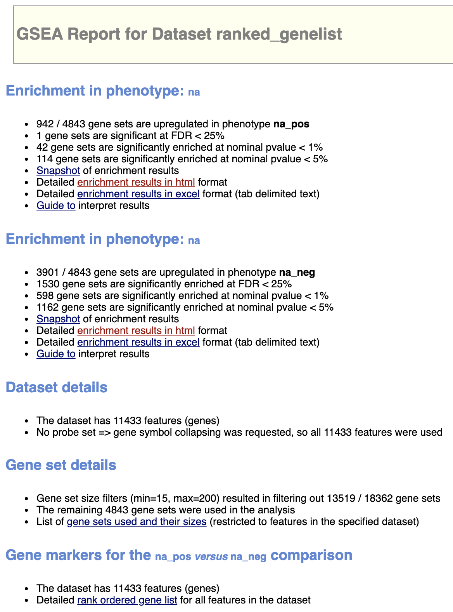

### The top 10 hits for upregulated

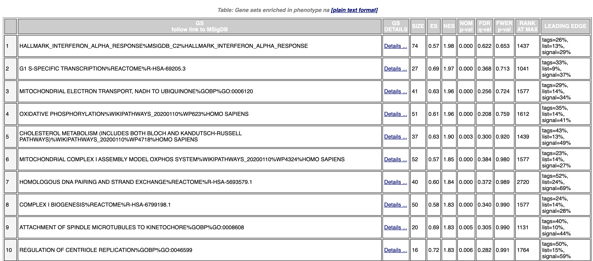

### The top 10 hits for downregulated genes

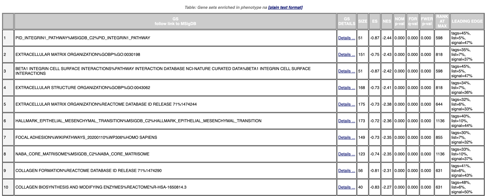

### Summarize
The top hit for upregulated gene is HALLMARK_INTERFERON_ALPHA_RESPONSE

* ES = 0.57
* NES = 1.98
* FDR = 0.622
* 74 genes in leading edge
* Top gene: B2M [ENSG00000166710](https://useast.ensembl.org/Homo_sapiens/Gene/Ontologies/molecular_function?db=core;g=ENSG00000166710;r=15:44711487-44718877) which is related to immune system process, iron ion transport, positive regulation of T cell mediated cytotoxicity and protein binding


The top hit for downregulated gene is PID_INTEGRIN1_PATHWAY

* ES = -0.87
* NES = -2.44
* FDR = 0.000
* 51 genes in leading edge
* Top gene: ITGA6 [ENSG00000091409](https://useast.ensembl.org/Homo_sapiens/Gene/Summary?db=core;g=ENSG00000091409;r=2:172427354-172506459) which is related to cell-substrate junction assembly and cell adhesion.

## Compare to the results from the thresholded analysis in Assignment 2.
In Assignment 2, the top hit for upregulate genes is oxidative phosphorylation (OXPHOS). But for this result, it is more specific to immune system process. The downregulated part is similar. Overall, The two results are both suggest that LY6E can influence the immune system.


# Visualize Gene set Enrichment Analysis in Cytoscape
Use Cytoscape 3.7.2 to create the Enrichment Map by following the [tutorial](https://cytoscape.org/cytoscape-tutorials/protocols/enrichmentmap-pipeline/)

* input the GSEA result
* Set FDR q-value cutoff to 0.1
* Build 
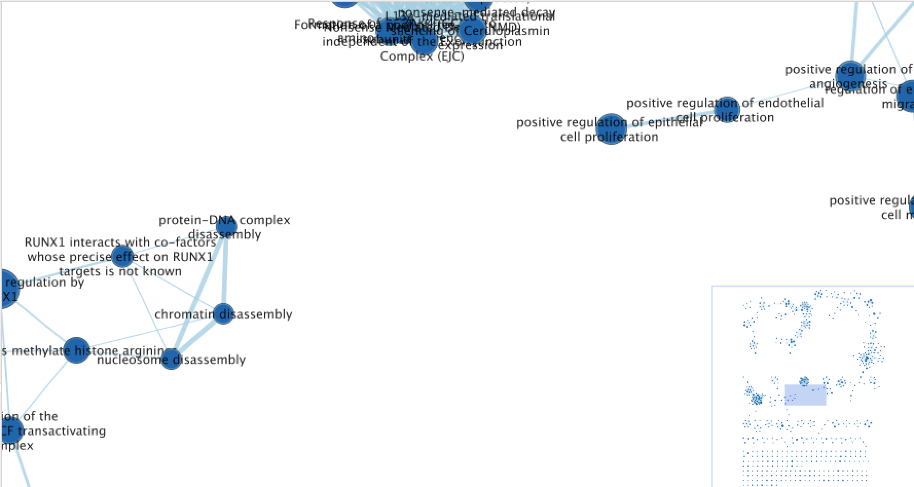

The map is very large and no red node, which caused by that there is no hit has FDR q-val < 0.1 in upregulate. So I select show advanced options and set q-value to 0.5, p-value to 0.0001 to reduce the number of nodes and keep enough red node. The enrichment map has 285 nodes and 682 edges
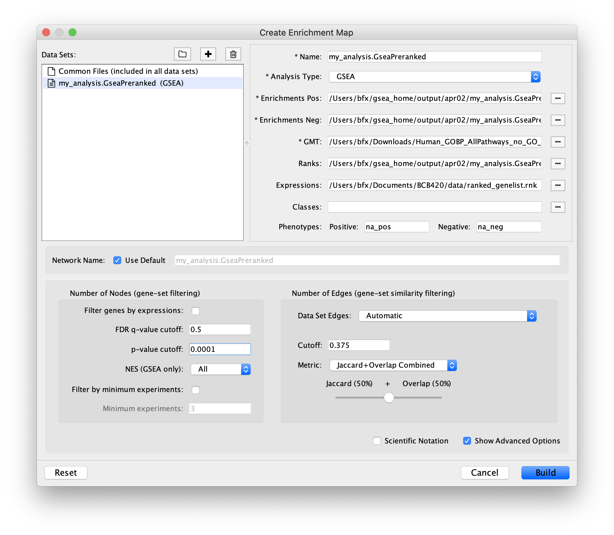
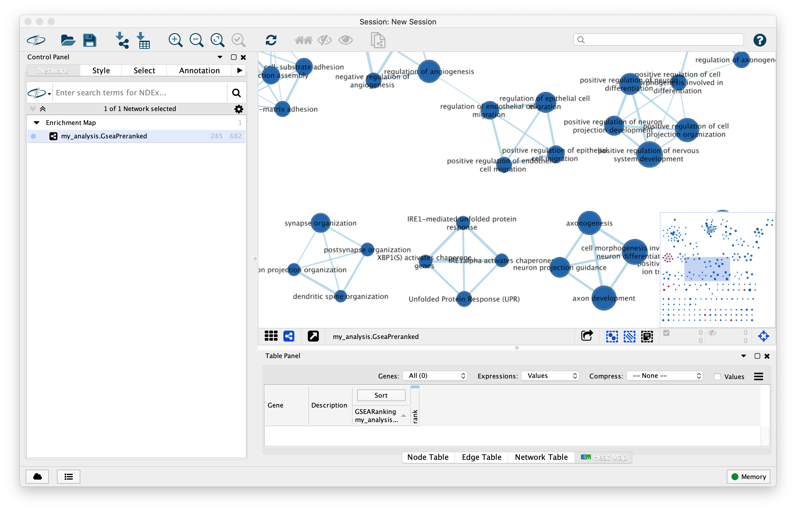
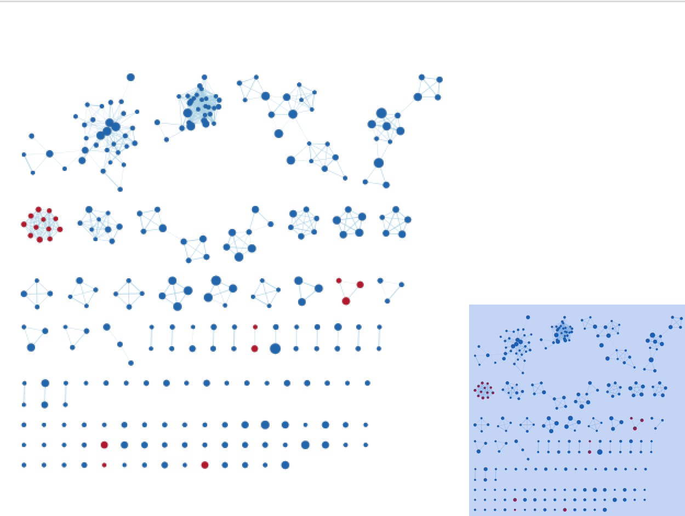

Annotate the network by AutoAnotate and label column with GS_DESCR
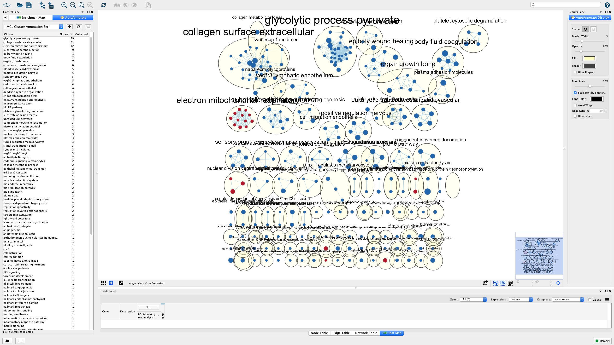

remove the clusters which has less than 6 nodes
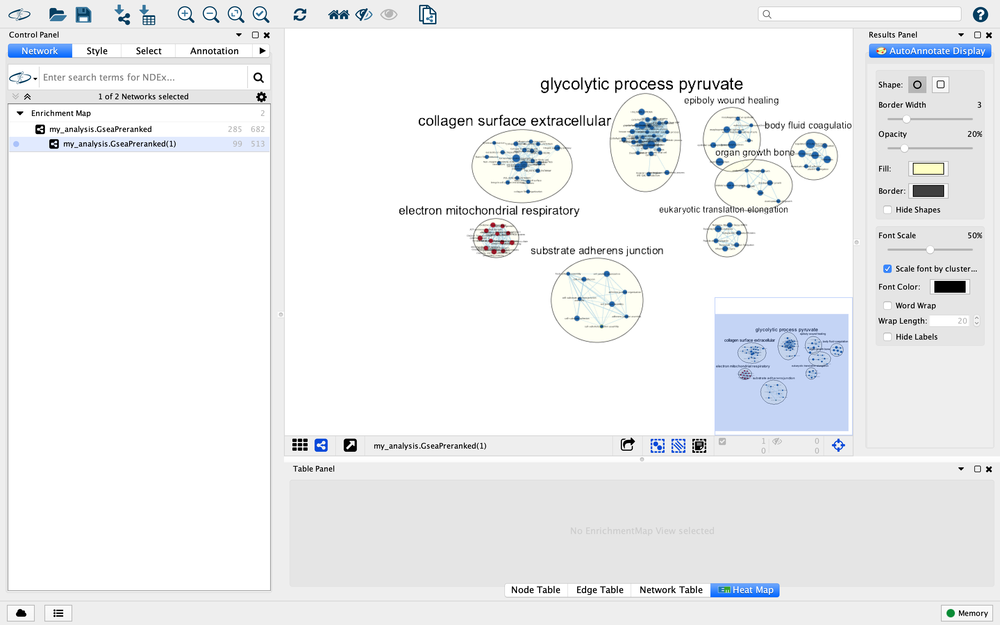

manually arrange the nodes to avoid the overlap

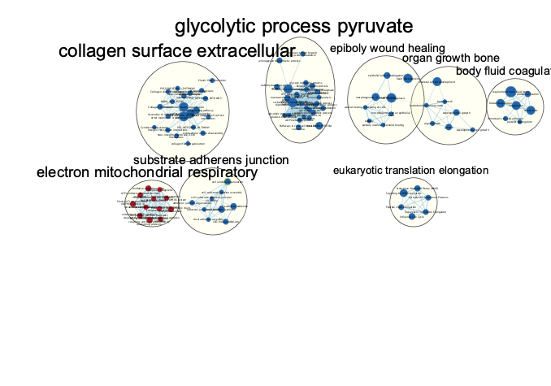

The legend of the enrichment map

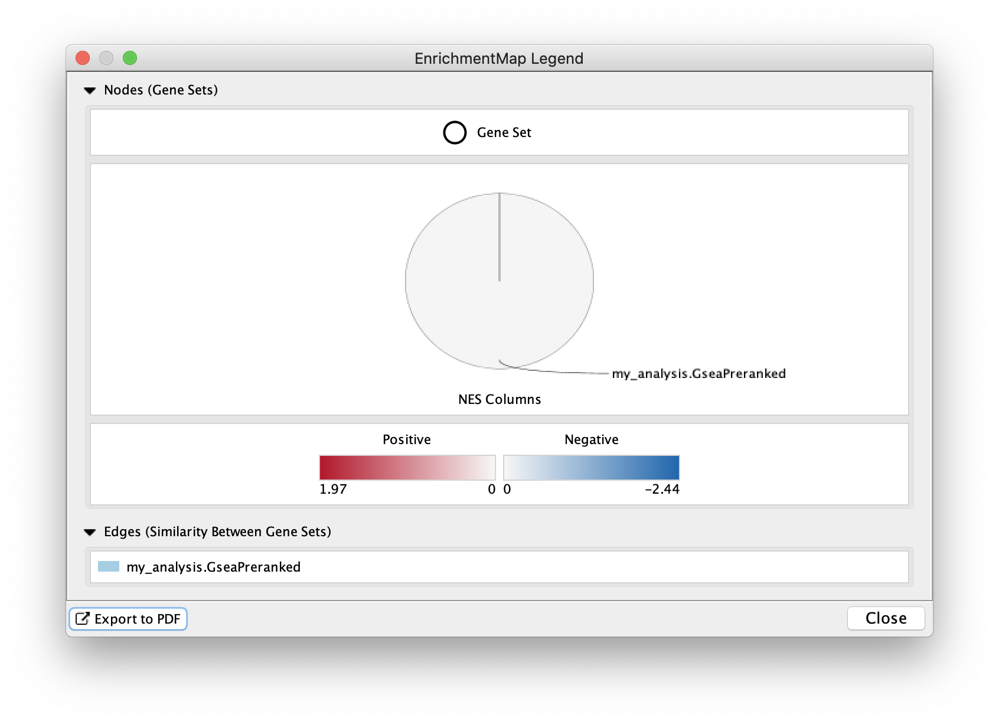

Collapse the network, there are 8 theme:

* glycolytic process pyruvate
* collagen surface extracellular
* electron mitochondrial respiratory (upregulate)
* substrate adherens junction
* epiboly wound healing
* body fluid coagulation
* organ growth bone
* eukaryotic translation elongation

They fit with the model Since the original paper conclude that LY6E promotes early step of the virus life cycle and enhances infectivity of some viruses and mitochondria is a platform for antiviral innate immunity and antiviral innate immunity requires oxidative phosphorylation (OXPHOS) activity.[@RLR2017]. And also the original paper said the LY6E will not influence the host transcriptome, for these 8 themes, only one is upregulated which also suggest that LY6E may affect the infectivity directly.


# Interpretation and detailed view of results

For the enrichment results, Most are downregulated. Same with the conclusion of Assignment 2, the mitochondria related theme is upregulated which support the conclusions discussed in the original paper that LY6E promotes early step of the virus life cycle and enhances infectivity of some viruses. Also I found an article "RLR-mediated antiviral innate immunity requires oxidative phosphorylation activity", published at 2017, said mitochondria is a platform for antiviral innate immunity and antiviral innate immunity requires oxidative phosphorylation (OXPHOS) activity.[@RLR2017], the downregulate themes seems like also facilitate the infectivity of viruses. Therefore LY6E must play some important role in early step of the virus life cycle and infectivity of some viruses.

## Post analysis 
Load the Human_TranscriptionFactors_MSigdb_April_01_2020_symbol.gmt from web, set test to Mann-Whitney (one side Greater)

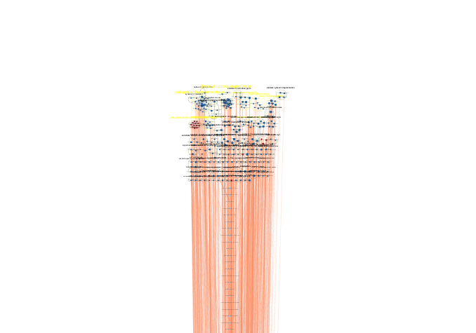

the original paper concluded the LY6E does not regulate IFN-mediated gene expression which means it will not influence the host transcriptome. The result shows that LY6E do play some important role in early step of the virus life cycle and infectivity of some viruses, since the ATP synthesis and immune system process are upregulated. Therefore LY6E may enhance viral infectivity directly instead of influencing the cellular transcriptome.


# Reference


